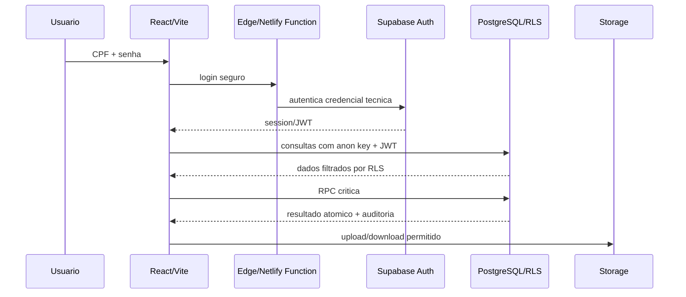

# V2 Architecture

Status: arquitetura proposta. Nao ha configuracao operacional nesta rodada.

## Stack alvo

```text
GitHub
  -> Netlify
      -> React + TypeScript + Vite
      -> Netlify Deploy Previews
      -> variaveis publicas do frontend

Supabase
  -> PostgreSQL
  -> Auth
  -> RLS
  -> Storage privado
  -> PostgreSQL Functions/RPC
  -> Edge Functions quando justificadas
```

## Por que Vite + React

Recomendacao: manter Vite + React + TypeScript.

Motivos:

- atende SPA operacional;
- ja e conhecido pelo legado;
- integra bem com Netlify;
- evita complexidade de Next.js sem necessidade clara;
- facilita testes, build rapido e deploy preview.

Nao usar Next.js nesta fase apenas por moda ou por Netlify suportar.

## Camadas

### UI

Responsavel por:

- layout;
- componentes;
- estados visuais;
- formularios;
- navegacao;
- acessibilidade;
- responsividade.

Nao deve:

- decidir permissao final;
- calcular regras financeiras criticas;
- criar transacoes compostas;
- montar SQL direto.

### Dominio

Responsavel por:

- validacoes puras;
- maquinas de estado;
- calculos deterministas;
- formatacao de dados de dominio;
- regras testaveis sem Supabase.

Exemplos:

- progresso de atividade;
- status de implantacao;
- comparabilidade de propostas;
- calculo de totais;
- elegibilidade de reembolso.

### Data access

Responsavel por:

- repositories;
- query layer;
- adaptadores Supabase;
- tratamento de erro;
- mapeamento DTO -> dominio.

Regra: telas nao devem espalhar chamadas Supabase aleatorias.

### Banco e RLS

Responsavel por:

- integridade referencial;
- autorizacao final;
- constraints;
- transacoes;
- auditoria;
- idempotencia.

## Ambientes

### Local

- Vite local.
- Supabase local via CLI quando a implementacao iniciar.
- Seeds artificiais.
- Sem dados reais sensiveis.

### Preview

- Netlify Deploy Preview por PR.
- Supabase DEV ou branch/ambiente controlado.
- Variaveis separadas.
- Nunca usar PROD.

### Production

- Netlify production.
- Supabase PROD.
- Secrets apenas em ambiente seguro.
- Migrations aplicadas por processo controlado.

## Variaveis de ambiente

Frontend pode receber apenas variaveis publicas:

- `VITE_SUPABASE_URL`
- `VITE_SUPABASE_ANON_KEY`
- `VITE_APP_ENV`

Secrets proibidos no frontend:

- service role key;
- JWT secret;
- senhas;
- tokens;
- chaves de integracao privada.

Secrets ficam em:

- Supabase Edge Functions;
- Netlify Functions;
- ambiente de CI seguro;
- nunca em Git.

## Supabase

### PostgreSQL

Usar para:

- dados operacionais;
- constraints;
- FKs;
- RLS;
- functions transacionais;
- auditoria;
- migrations.

### Auth

Usar como motor de:

- senha;
- sessao;
- JWT;
- refresh token;
- logout;
- uid tecnico.

CPF sera autenticador visivel, mas nao PK nem FK.

### RLS

Obrigatorio desde a primeira migration.

### Storage

Usar buckets privados.

Nunca usar bucket publico para facilitar.

### Realtime

Usar somente onde trouxer beneficio real:

- contadores leves de pendencias;
- atividade/timeline em telas compartilhadas;
- notificacoes operacionais futuras.

Nao usar realtime para tudo.

## Netlify

Usar para:

- hospedagem frontend;
- deploy;
- previews;
- variaveis por ambiente;
- redirects para SPA;
- Functions apenas quando fizer sentido.

Netlify Functions podem ser usadas para:

- integracoes externas que devam ficar proximas do frontend;
- webhooks externos;
- tarefas que nao dependam diretamente de contexto Supabase/RLS.

Preferir Supabase Edge Functions para:

- login CPF;
- signed URL/preview com checagem de usuario;
- operacoes que precisam service role e contexto de RLS/Supabase.

## Operacoes: CRUD direto vs RPC vs Function

### CRUD direto via Supabase + RLS

Usar quando:

- uma tabela simples;
- uma linha por vez;
- constraints e policies resolvem;
- sem segredo;
- sem transacao composta.

Exemplos:

- listar lojas acessiveis;
- listar itens;
- listar fornecedores;
- listar anexos visiveis;
- editar metadados simples permitido por RLS.

### PostgreSQL Function/RPC

Usar quando:

- precisa transacao;
- precisa idempotencia;
- precisa criar varios registros;
- precisa validar estado anterior;
- precisa timeline + auditoria atomicas;
- precisa bloquear conflito.

Exemplos:

- iniciar implantacao;
- atualizar atividade;
- bloquear atividade;
- reprogramar inauguracao;
- publicar checklist mestre;
- criar/selecionar proposta agrupada;
- criar compra a partir de proposta;
- registrar pagamento;
- solicitar reembolso.

### Supabase Edge Function

Usar quando:

- ha segredo;
- ha fluxo de autenticacao;
- ha rate limit;
- ha geracao de URL assinada com validacao extra;
- ha processamento de arquivo/thumbnail;
- ha integracao externa.

### Netlify Function

Usar quando:

- for webhook ou integracao melhor acoplada ao Netlify;
- nao houver ganho de manter no Supabase;
- nao exigir acesso direto transacional ao banco.

## Fluxo de request recomendado



## Observabilidade

Planejar desde o inicio:

- correlation/request id;
- erros normalizados;
- logs de functions;
- logs de autenticacao;
- auditoria de negocio;
- sem CPF completo, senha, token ou documentos sensiveis em log.

## Testes de arquitetura

Obrigatorio:

- unit tests de dominio;
- testes de repositories;
- testes de RLS;
- testes de migrations;
- testes de RPC;
- testes de functions;
- E2E dos fluxos criticos;
- testes mobile/responsivo para lojas, atividades e anexos.

## Anti-padroes proibidos

- `if perfil === "Administrador"` espalhado no frontend;
- service role no cliente;
- CPF como foreign key;
- senha propria em tabela de negocio;
- bucket publico para arquivos privados;
- functions para CRUD simples;
- transacao critica no frontend;
- replica de abas Sheets como tabelas identicas;
- copiar `Code.gs`.
