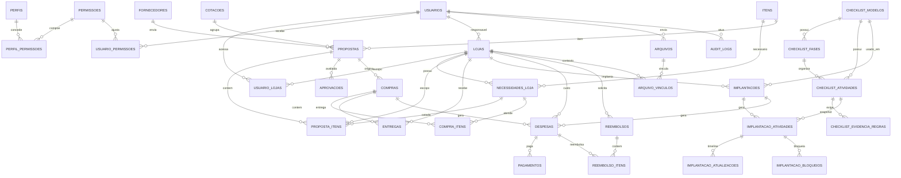

# V2 Database Model

Status: desenho relacional inicial. Nao criar migrations nesta rodada.

## Principios

- PK tecnica em UUID.
- `codigo_negocio` ou `codigo_legado` unico quando for util ao usuario/migracao.
- FKs reais.
- Check constraints para status, valores positivos, percentuais e datas.
- Indexes por loja, status, responsavel, datas e FKs frequentes.
- Soft delete para entidades com historico.
- Auditoria tecnica separada de timeline funcional.
- Transacoes reais para operacoes criticas.

## Entidades principais

### Identidade e autorizacao

`usuarios`

- PK: `id uuid`
- FK: `auth_user_id uuid unique`
- Campos: nome, cpf_hash, cpf_last4, email, telefone, status, must_change_password, last_login_at, created_at, updated_at.
- Constraints: cpf_hash unique, status valido.
- Indexes: auth_user_id, cpf_hash, status.

`perfis`

- PK: `id uuid`
- Campos: chave, nome, descricao, ativo.
- Unique: chave.

`permissoes`

- PK: `id uuid`
- Campos: modulo, acao, descricao.
- Unique: modulo + acao.

`perfil_permissoes`

- PK: `id uuid`
- FK: perfil_id, permissao_id.
- Unique: perfil_id + permissao_id.

`usuario_permissoes`

- PK: `id uuid`
- FK: usuario_id, permissao_id, loja_id nullable.
- Campos: efeito grant/deny, expires_at, motivo.
- Indexes: usuario_id, permissao_id, loja_id.

`usuario_lojas`

- PK: `id uuid`
- FK: usuario_id, loja_id.
- Unique: usuario_id + loja_id.

### Lojas

`lojas`

- PK: `id uuid`
- Unique: `codigo_negocio`, `codigo_legado`.
- Campos: nome, cidade, uf, endereco, responsavel_usuario_id, status, data_inauguracao_planejada, data_inauguracao_real, observacoes.
- Indexes: uf, status, responsavel_usuario_id, data_inauguracao_planejada.

### Itens e necessidades

`itens`

- PK: `id uuid`
- Campos: codigo_negocio, codigo_operacional, grupo, area, nome, especificacao, quantidade_padrao, status_definicao, ativo.
- Indexes: grupo, area, status_definicao.

`necessidades_loja`

- PK: `id uuid`
- FK: loja_id, item_id.
- Campos: codigo_legado, quantidade, prioridade, status, observacoes.
- Unique: loja_id + item_id quando ativo.
- Indexes: loja_id, item_id, status.

### Fornecedores, cotacoes e propostas

`fornecedores`

- PK: `id uuid`
- Campos: codigo_negocio, nome, documento_hash/documento_masked, cidade, uf, contato, telefone, email, rating, ativo.

`cotacoes`

- PK: `id uuid`
- Campos: codigo_negocio, titulo, status, criada_por, aberta_em, encerrada_em.

`propostas`

- PK: `id uuid`
- FK: cotacao_id, fornecedor_id.
- Campos: codigo_negocio, item_id, status, origem, preco_unitario, frete, outros_custos, quantidade_total, subtotal_itens, total, forma_pagamento, parcelas, prazo_dias, validade, selecionada, observacoes, version.
- Indexes: cotacao_id, fornecedor_id, item_id, status, selecionada.

`proposta_itens`

- PK: `id uuid`
- FK: proposta_id, necessidade_id, loja_id, item_id.
- Campos: quantidade, preco_unitario_snapshot, subtotal.
- Unique: proposta_id + necessidade_id.

`aprovacoes`

- PK: `id uuid`
- FK: proposta_id, solicitante_id, aprovador_id.
- Campos: status, solicitada_em, decidida_em, motivo.

### Compras e entregas

`compras`

- PK: `id uuid`
- FK: proposta_id, fornecedor_id.
- Campos: codigo_negocio, status, data_compra, comprador_id, valor_total, observacoes.

`compra_itens`

- PK: `id uuid`
- FK: compra_id, necessidade_id, loja_id, item_id.
- Campos: quantidade, valor_unitario, valor_total, status.

`entregas`

- PK: `id uuid`
- FK: compra_id, loja_id.
- Campos: status, previsao, entregue_em, conferido_em, recebedor_id, observacoes.

### Checklist e implantacao

`checklist_modelos`

- PK: `id uuid`
- Campos: codigo_negocio, versao, nome, status, descricao, checksum, publicado_em, publicado_por.
- Unique: codigo_negocio, versao.

`checklist_fases`

- PK: `id uuid`
- FK: modelo_id.
- Campos: nome, ordem.
- Unique: modelo_id + ordem.

`checklist_atividades`

- PK: `id uuid`
- FK: modelo_id, fase_id.
- Campos: codigo, ordem, acao, descricao, offset_dias, responsavel_padrao, obrigatoria, critica, evidencia_obrigatoria, minimo_evidencias.
- Unique: modelo_id + codigo.

`checklist_evidencia_regras`

- PK: `id uuid`
- FK: atividade_modelo_id.
- Campos: tipo, minimo, obrigatoria_para_conclusao.

`implantacoes`

- PK: `id uuid`
- FK: loja_id, modelo_id, coordenador_id.
- Campos: codigo_negocio, status, data_base, data_planejada_atual, data_real, iniciada_em, encerrada_em, version.
- Unique parcial: uma implantacao ativa por loja.

`implantacao_atividades`

- PK: `id uuid`
- FK: implantacao_id, loja_id, atividade_modelo_id.
- Campos: snapshots de fase/acao/offset/responsavel/obrigatoriedade/criticidade/evidencia, data_alvo_original, data_alvo_atual, responsavel_id, status, progresso, data_inicio_real, data_conclusao_real, ultima_observacao, version.
- Indexes: loja_id, implantacao_id, responsavel_id, status, data_alvo_atual.

`implantacao_atualizacoes`

- PK: `id uuid`
- FK: atividade_id, implantacao_id, loja_id, usuario_id.
- Campos: tipo, texto, status_anterior, status_novo, progresso_anterior, progresso_novo, ocorreu_em, correlation_id.

`implantacao_bloqueios`

- PK: `id uuid`
- FK: atividade_id, implantacao_id, loja_id.
- Campos: motivo, status_anterior, progresso_no_bloqueio, bloqueado_em, bloqueado_por, desbloqueado_em, desbloqueado_por, observacao_desbloqueio.
- Unique parcial: um bloqueio ativo por atividade.

### Arquivos

`arquivos`

- PK: `id uuid`
- Campos: bucket, storage_path, nome_original, mime_type, tamanho_bytes, checksum, categoria, uploaded_by, removed_at, removed_by, motivo_remocao.
- Indexes: uploaded_by, categoria, mime_type, removed_at.

`arquivo_vinculos`

- PK: `id uuid`
- FK: arquivo_id, loja_id nullable.
- Campos: modulo, entidade_tipo, entidade_id, contexto, evidencia, created_at.
- Indexes: modulo + entidade_id, loja_id.

### Financeiro

`despesas`

- PK: `id uuid`
- FK: loja_id, implantacao_id nullable, compra_id nullable, fornecedor_id nullable.
- Campos: categoria, descricao, status, valor_previsto, valor_aprovado, valor_contratado, valor_comprado, valor_pago, reembolsavel, competencia.

`pagamentos`

- PK: `id uuid`
- FK: despesa_id.
- Campos: valor, data_pagamento, metodo, status, comprovante_arquivo_id, observacoes.

`reembolsos`

- PK: `id uuid`
- FK: loja_id.
- Campos: codigo_negocio, status, valor_solicitado, valor_aprovado, valor_reembolsado, solicitado_em, aprovado_em, reembolsado_em.

`reembolso_itens`

- PK: `id uuid`
- FK: reembolso_id, despesa_id.
- Campos: valor_solicitado, valor_aprovado, motivo_glosa.

### Auditoria

`audit_logs`

- PK: `id uuid`
- Campos: actor_usuario_id, action, entity_type, entity_id, before_json, after_json, occurred_at, correlation_id, origin, ip_hash.
- Indexes: entity_type + entity_id, actor_usuario_id, occurred_at, correlation_id.

`idempotency_keys`

- PK: `id uuid`
- Campos: key, operation, actor_usuario_id, request_hash, response_json, status, created_at, expires_at.
- Unique: operation + key + actor_usuario_id.

## ERD inicial

## Constraints e indexes obrigatorios

- `lojas.uf` com tamanho 2.
- `necessidades_loja.quantidade > 0`.
- `propostas.preco_unitario >= 0`, frete/outros custos >= 0.
- `implantacao_atividades.progresso in (0,25,50,75,100)`.
- `implantacao_atividades.status` coerente com progresso por RPC.
- uma implantacao ativa por loja.
- um bloqueio ativo por atividade.
- `pagamentos.valor > 0`.
- `reembolsos.valor_* >= 0`.
- indexes em todas as FKs.
- indexes compostos para dashboards: loja/status/data/responsavel.

## Soft delete

Usar `deleted_at`, `deleted_by` e motivo quando:

- fornecedor;
- proposta;
- compra;
- arquivo;
- despesa;
- permissao individual;
- checklist rascunho.

Nao apagar fisicamente registros historicos usados por compras, financeiro, auditoria ou implantacoes.
